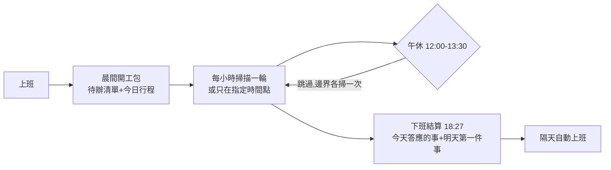
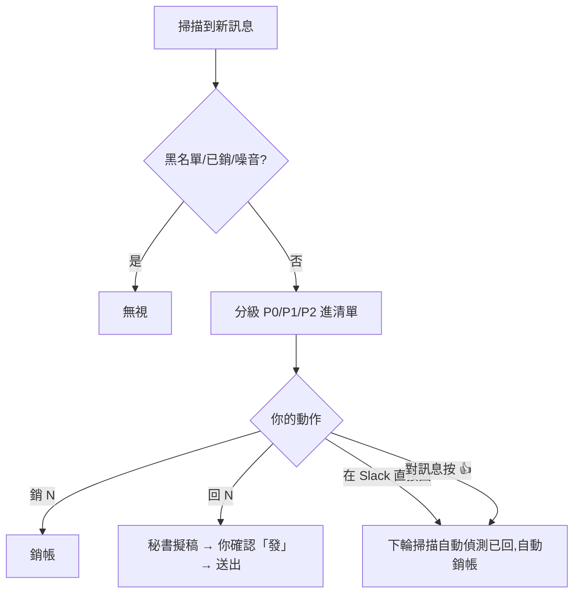

# Slack 秘書 — 功能說明

> 一個跑在你自己 Claude Code 終端裡的 Slack 待回覆秘書:定時掃描你的 DM、被點名、重點頻道,整理成待辦清單,幫你記事、提醒行程、開會時自動擋訊息。**所有資料只在你自己的電腦,用你自己的帳號,別人看不到。**

---

## 運作總覽

- 掃描範圍:**DM+被點名** / **watchlist 重點頻道**(有新訊息就報)/ **全 workspace @here** / 你自己發的訊息(偵測你答應別人的事)
- 每則待辦有**永久編號**,依急迫度分級:🔴 **P0**(點名你+有時限)/ 🟡 **P1**(在等你回)/ ⚪ **P2**(FYI)
- P1 連續兩輪沒回會自動升 P0;報告都會同步到 bot DM,**手機看得到、也能在裡面下指令**

## 一則訊息的一生

## 口令速查

### 值班
| 口令 | 效果 |
|---|---|
| 上班 / 秘書 / onduty | 建齊排程+立刻掃一次 |
| 省量模式 / 標準模式 | 掃描頻率減半+訊息瘦身(Pro 方案額度緊時用) |
| 掃描改一小時一次 / 改成每 N 分掃一次 | 定期排程模式,調間隔 |
| 改成指定時間掃 / 只在 10 點 14 點 16 點半掃 | 指定排程模式,只在你講的時間點掃(不套午休) |
| 改回定時掃描 | 切回定期排程 |
| 下班 | 提早結算+停掃描(隔天照常自動上班) |
| 關掉秘書 | 全部排程停掉 |
| 掃 slack | 單次掃描,不進值班模式 |

### 待辦操作(終端或 bot DM 都能下)
| 口令 | 效果 |
|---|---|
| 銷 3 / 銷 3 5 8 | 銷帳 |
| react 3 :+1: / 按 3 讚 / 按 3 確認中 | 以你的身分按 react(ack 類順帶銷帳;「確認中/請稍候」= :loading:,自動轉暫回追蹤) |
| 回 3 | 秘書擬回覆草稿,你說「發」才送出(**絕不擅自發訊**) |
| 回 3:好,下午給你 | 照你給的內容擬,確認才發 |
| 回 3 用 chase | 套指定範本 |
| 看全部 | 完整清單(平常只報新增/升級) |
| 加待辦 X / 看待辦 / 待辦完成 N / 刪待辦 N | 你自己記的常駐待辦(做完才消,與上面的待回覆編號各自獨立);內容帶日期會記到期並提前提醒 |
| 追這則 <連結> / 誰沒回 N / 停追 N | 點名回覆追蹤:追你發的「請大家回覆/按 done」訊息,回報已完成 x/y 與未完成名單。判定=**完成**:按 :收到:/:done:(白名單可調 config)或 thread 回覆內容明確表示做完才算;只回「收到晚點看」列「已回未確認完成」。自動偵測會先問要不要追,全員到齊自動銷 |
| 停追串 N / 這串不用追了 | 把該 thread 移出續追(跟上面的「停追 N」不同,那是點名追蹤)。**之後對方再 tag 你,那則照常進清單,但不會自動恢復追整串** |
| 重新追這串 N | 把手動停追過的 thread 放回續追 |

### 黑白名單
| 口令 | 效果 |
|---|---|
| 無視 X / 這個群不用管 | 整個對話徹底靜音 |
| 取消無視 X | 恢復 |
| 例行的不用列 | 該文案的機器人提醒以後摺疊 |
| 我慣用的 react 是 X | 你按過該 emoji 的訊息自動銷帳 |
| 以後 X 代表 Y | 個人語意字典(semantics.md):emoji/用詞/句型對你的含意(銷帳/繼續追/暫回…)、口令別名,全存個人檔,**升級不會被蓋** |

### 備忘與行程
| 口令 | 效果 |
|---|---|
| 記一下 XXX | 單一入口自動分流:**要做的事**(不管有沒有時程)→ 進待辦,追到完成才消;純事件記錄(請假/會議/某人不在)→ 備忘,提醒完過期自清;長期資訊 → 存記憶 |
| 看備忘 / 刪備忘 N | 管理備忘 |
| (在 Slack 任何地方打)「秘書記一下 XXX」 | 一樣會記,bot 回 📝 確認 |
| (在 Slack 任何地方打)「秘書幫我分析/查/整理 XXX」 | 對內的直接做完發你 DM;要對外發的先擬稿,你確認才送 |

行程功能(需連 Google Calendar):開工包列今日行程、**會前 15 分 bot 提醒**、訊息裡約了新會議會自動建日曆([秘書] 前綴,預設不邀他人)。說「幫我發會議邀請 / 幫我邀請 X 和 Y」→ 秘書從 Slack profile 抓對方公司信箱,把與會人加進日曆事件、Google 自動寄邀請信;profile 查不到 email 的會先列給你確認才發。

### 回覆範本
內建四個:`ack` 收到確認 / `chase` 客氣催稿 / `busy` 忙碌晚點回 / `defer` 需確認延後回。
| 口令 | 效果 |
|---|---|
| 看範本 | 列清單 |
| 建範本 <情境> | 秘書擬 1-2 版官方客氣版讓你挑 |
| 改範本 X / 刪範本 X | 管理;也可直接編輯 `templates.md` |

### 狀態自動回覆(會議/請假)
你的 Slack 狀態含「會議」→ 會議模式;含「請假/休假」→ 請假模式。模式中有人 DM 你或點名你,秘書**以你的帳號**回一句止血訊息(開頭必標「(自動回覆)」,同一人不重發,不承諾內容);請假版會 tag 你 config 裡設的代理人。模式結束自動補掃,整理「你不在的這段時間」清單。
| 口令 | 效果 |
|---|---|
| 開/關會議自動回覆、開/關請假自動回覆 | 兩開關獨立 |
| 會議/請假掃描頻率改 N 分 | 調模式中的掃描間隔 |

### 專案里程碑
| 口令 | 效果 |
|---|---|
| 建專案 X:美術 10/1、工程 10/15、內測 10/22、上線 11/1 | 一次建整條時程 |
| X 工程改 10/20 | 改期+自動檢查下游被壓縮多少 |
| X 美術完成 | 銷該里程碑(逾期沒銷會被追問) |
| 看專案 X / 看所有專案 | 隨時看全貌 |

平時完全沉默;里程碑前 7 天才開始出現在開工包,前 3 天/前 1 天/當天連續提醒;改期或逾期時主動算「下游只剩 N 天(原 M 天)」。

### 主動提醒(不用下口令)
- 別人欠你的東西 **2 天沒進展** → 提醒你「該催了」+擬好催稿話術(催不催你決定)
- 你答應別人的事接近時限 → 自動升 P1
- 週五下班結算附本週大事清單(週報素材)
- **整合健檢** → 下班結算檢查五條整合(Slack/bot/user token/日曆/信箱),沒串好的提醒你少了什麼功能;回「X 不用了」就永久閉嘴
- 下班結算附 📧 信箱檢查:要行動/有期限的信(近期到期自動進備忘)+重要來源/自家產品的非例行信;自動報表、廣告、釣魚信、出勤簽核全濾掉
- **行程撞期** → 開工包標「⚠️ 撞期:A × B」;中途新增的行程撞到也會提醒
- **請假日有會議** → 預約請假當下就查日曆列給你看;請假當天開工包再標一次,問要改期/取消/照開
- **「確認中」追蹤** → 你回了確認中/請稍候(文字或 :loading: 類 react)不算回完:待辦掛著標 ⏳,超過 4 小時沒給後續就提醒你(emoji/句型/時限都在 config.style 可調)
- **回報單變化追蹤** → 開工包與下班結算列你名下的回報單時,順便比對上次:🆕 新指派給你、🔄 狀態被改了(「待處理 → 處理中」)、✅ 本輪完成(報一次喜就不再列)、👋 已不在你名下(改指派或單被刪)。沒變化的照舊列,不吵你。**零額外 API 呼叫**,只是多存一份快照做比對
- **Thread 續追(三層降頻)** → 對方只在 thread 開頭 tag 你一次,後面繼續討論沒再 tag,一樣追得到;你在那串回過也不算結案。按活躍度分三檔,不是追或不追的二分法:
  - **活躍**(3 天內有人講話)→ 跟著主掃描一起追(預設每小時),預設同時 20 串(一個工作日約 16~18 串,下午常會滿——滿了把最久沒動的降到觀察名單,不是丟掉)
  - **觀察名單**(3 天沒動靜)→ 降到只在**上班開工包與下班結算各看一次**,有人講話就復活回活躍;預設最多 50 串
  - **真正不追**(在觀察名單躺滿 14 天還是沒人講話)→ 移出。之後若有人 tag 你,照樣進清單並重新開始追

## Pro 方案($20)省量建議

秘書全天值班對 Max 方案無感,Pro 方案建議做這三件事:

1. **值班用 Sonnet**:啟動時 `claude --model sonnet`,或進終端後打 `/model sonnet`——掃描工作 Sonnet 完全夠用,別燒 Opus 額度
2. **口令「省量模式」**:掃描間隔加倍(60→120 分)、bot 訊息瘦身;「標準模式」切回。額度真的撞牆時秘書也會自動降頻並通知你。**更省的做法是改用指定排程**(「只在 10 點 14 點 17 點掃」)——一天三輪,額度可控又不會漏掉關鍵時段
3. **砍掉不需要看的**:「無視 X」整群靜音(比銷帳更省——連判斷都不做);watchlist 只留 2~3 個真正重要的頻道;「例行的不用列」把機器人日報進黑名單;thread 續追 `max_threads` 調小(20→8)、`observe_max` 調小(50→20)或 `observe_days` 調短(14→7),省量模式下兩個上限都會自動減半

## 可以調整什麼(config.json)

| 欄位 | 說明 |
|---|---|
| `user` / `bot` | 你的身份與 bot 資訊(安裝精靈代填) |
| `watchlist` | 重點頻道白名單+各頻道分級規則 |
| `muted_channels` | 黑名單 |
| `schedule.scan_mode` | `interval` 定期排程(預設,每 `scan_interval_min` 分鐘,預設 60)或 `fixed` 指定排程(只在 `scan_times` 的時間點掃,不套午休) |
| `schedule` 其他 | 開工/下班時間、午休時段(設 null 取消午休)、會議模式掃描間隔 |
| `deputies` | 請假時的代理人對照(可留空) |
| `style.tone_notes` | 擬稿語氣微調(留空=預設官方客氣) |
| `style.ack_emojis` | react 銷帳用的 emoji |
| `style.pending_emojis` / `pending_patterns` / `pending_timeout_hours` | 「確認中」暫回追蹤的 emoji、句型、催促時限(清空前兩者=停用) |
| `thread_watch.active_hours` / `max_threads` | Thread 續追第一層:幾小時內有人講話算活躍(預設 72=3 天)、同時追幾串(預設 20)。**沒有獨立掃描頻率**,跟著主掃描走 |
| `thread_watch.observe_days` / `observe_max` | 第二層觀察名單:躺幾天沒動靜就真正不追(預設 14)、名單上限(預設 50)。固定只在開工包與下班結算複查,不可調頻率 |
| `thread_watch.enabled` | 整個 thread 續追功能開關 |
| `auto_reply_config` | 會議/請假自動回覆開關 |
| `my_todos` | 自記待辦清單開關與顯示輪型(預設開,出現在開工包/結算) |
| `report_lists` | Slack List 回報單掃描(選配,預設關;跟安裝精靈說「加回報單」問答式設定,需 user token 加 `lists:read` + `files:read`)。每項的 `track_changes`(預設開)= 報出單子的變化 |

多數欄位有對應口令可即時調,不用手動改檔。

## 使用須知

- **終端視窗關掉 = 秘書停止**。排程只活在該視窗裡,重開打「上班」即恢復(待辦資料不會丟)。日常用 repo 附的 `secretary-start.bat` 啟動(桌面雙擊,精靈裝機時會放好;可另放一份到 shell:startup 開機自動值班)
- 週末與台灣國定假日自動不上班;假日手動打「上班」可強制值班
- 掃描會消耗 Claude 用量,方案較低可把 `scan_interval_min` 調大,或改用指定排程只掃幾個關鍵時間點
- 鐵則:除了明定的「(自動回覆)」止血訊息,**秘書絕不主動替你發任何 Slack 訊息**,所有實質回覆都要你確認
