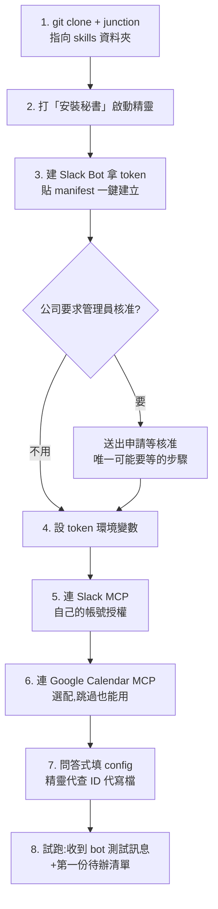

# Slack 秘書 — 安裝說明

> 安裝過程大部分由**安裝精靈**自動帶著走:你只要把檔案放對位置、打「安裝秘書」,它會自動診斷你裝到哪一關、只教你下一步。這份文件是全貌概覽+疑難排解。

---

## 前置需求

- Claude Code(桌面版或 CLI),登入自己的帳號
- 電腦在上班時間開著(秘書跑在你的終端裡,視窗關掉就停)
- Claude 用量:預設每 30 分掃一輪,方案較低建議裝好後把頻率調成 60 分

## 安裝流程



### Step 1:放檔案(git 安裝,建議)

1. 確認有 git(`git --version`;沒有 → `winget install --id Git.Git`)
2. Clone repo(網址向 Tim 索取):
   ```
   git clone https://github.com/TimDaChung/secretary-kit.git %USERPROFILE%\secretary-kit
   ```
3. 建 junction 讓 skills 指向 repo(之後 `git pull` 即升級;cmd 執行,或請安裝精靈代做):
   ```
   mklink /J "%USERPROFILE%\.claude\skills\secretary" "%USERPROFILE%\secretary-kit\secretary"
   mklink /J "%USERPROFILE%\.claude\skills\secretary-setup" "%USERPROFILE%\secretary-kit\secretary-setup"
   ```

**zip 備援**:沒 git 也能裝——跟 Tim 要 zip,解壓後把 `secretary/` 和 `secretary-setup/` 放進 `C:\Users\<你的帳號>\.claude\skills\`;只是不能用「秘書升級」一鍵升級。

### Step 2:啟動精靈

開 Claude Code,輸入:**安裝秘書**

(小提醒:日常值班建議用 Sonnet 跑——`claude --model sonnet` 啟動,Pro 方案尤其重要,詳見功能說明的省量建議)

之後照精靈指示走即可。它會:
- 自動檢查你卡在哪一關(重複執行安全,隨時打「檢查安裝進度」續關)
- 給你 Slack App 的 manifest(貼上即建,權限已配好最小範圍)
- 代查你的 Slack ID、代寫設定檔、代測 token
- 同一關卡住兩次會停下來,把錯誤整理好請你找 Tim

### 裝完第一天

1. 打「上班」開始值班,收到晨間開工包就是活的
2. 先學三個口令就夠:**上班**、**下班**、**銷 N**;其他看《功能說明.md》
3. 想每天自動開:把「上班」做成開機捷徑(問 Tim 拿 bat 範本)

## 疑難排解

| 症狀 | 原因與解法 |
|---|---|
| 打「安裝秘書」沒反應 | 資料夾放錯層:確認是 `skills\secretary-setup\SKILL.md`,不是 `skills\secretary-kit\secretary-setup\...` |
| token 驗證失敗(invalid_auth) | token 複製不完整,或 `setx` 後沒重開終端(必須整個關掉重開) |
| bot 建立時要求核准 | 正常,等管理員核准信再回來打「檢查安裝進度」 |
| Slack MCP 工具找不到 | 到 claude.ai/settings/connectors 確認 Slack 已連線且是自己的帳號 |
| 秘書沒有自動掃 | 終端視窗被關掉了;重開打「上班」即恢復,資料不會丟 |
| 手機沒收到通知 | 確認 Slack App 對 bot DM 的通知沒被關 |

## 隱私說明

- 秘書用**你自己的** Slack 帳號與 bot token 運作,資料(待辦、備忘、設定)全部只存在你電腦的 `skills\secretary\` 資料夾
- 沒有共用伺服器、不回傳任何資料;其他人(包括 Tim)看不到你的待辦與訊息
- 它能讀到的 Slack 內容 = 你的帳號本來就看得到的,不多不少
